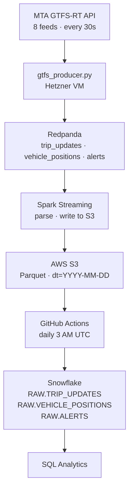

# Video Demo
<div align="center">
  <a href="https://www.youtube.com/watch?v=uCKDGxDRbjI" target="_blank">
    
  </a>
  <p><em>Click to watch!</em></p>
</div>

# MTA Subway Reliability Tracker

Streaming pipeline that ingests live MTA GTFS-RT feeds, archives every raw event to S3 Parquet, and loads them into Snowflake for historical reliability analysis — giving journalists and commuters flight-delay-style stats for the NYC subway.

---

## What This Project Demonstrates

The pipeline is the foundation; the engineering that matters is in **trusting the
numbers it produces.** Building this surfaced a series of data-quality problems that
each had to be diagnosed and validated before any reliability statistic could be
believed:

- **The feed doesn't report what it appears to.** MTA's `delay_seconds` field is
  populated for exactly one line (the L) out of 30 — every other route reports
  zero across tens of millions of rows. Rather than ship "100% on-time" for 29
  lines, delay is **computed independently** from the static schedule join.

- **The computation is validated against ground truth.** The L is the only line
  with both a feed delay and a computable one, so it's the validation harness:
  the schedule-derived delay matches MTA's to a **15-second median (90% within
  30 seconds)**. The validated method is then applied system-wide, with the
  extrapolation stated explicitly rather than assumed.

- **Three defects found and corrected through that validation:**
  a **~176× prediction-history inflation** (the raw feed keeps every poll's
  prediction; deduplicated to the final pre-arrival prediction via a window
  function in dbt staging); a **4-hour UTC/EDT timezone offset** (diagnosed from
  the error being exactly 14,400 seconds; fixed with DST-aware conversion); and a
  **GTFS past-midnight (`hour ≥ 24`) anchoring bias** on overnight service.

- **Residual artifacts are documented, not hidden.** A small after-midnight skew on
  trunk IRT lines and consistent schedule padding on shuttle lines are
  characterized in [`KNOWN_CHARACTERISTICS.md`](./KNOWN_CHARACTERISTICS.md) rather
  than masked — including the limitation that cross-line comparison rests on a
  method validated only where ground truth exists.

**The analytical layer** is a layered dbt project (staging → marts) on Snowflake:
a deduplicated, delay-computed, timezone- and midnight-corrected base feeding a
cross-line reliability mart (on-time rates and delay percentiles by route ×
time-of-day × day-type) and an alert-correlation mart (in progress, pending alert
data accumulation).

> **Stack:** Kafka (Redpanda) · Spark Structured Streaming · S3 · Snowflake · dbt ·
> GitHub Actions · Docker. **Engineering themes:** stateless streaming ingestion with
> idempotent loading, validation against ground truth, and disciplined data-quality
> handling.

## The Problem

MTA publishes live feeds every 30 seconds but no historical per-station reliability data exists. There is no equivalent of flight-delay statistics for the subway.

## The Solution

A streaming pipeline that ingests GTFS-RT every 30s, writes every raw event to S3 Parquet partitioned by date, and loads them into Snowflake daily for analysis. All aggregations are done in Snowflake at query time — any resolution, any time window, any grouping.

---

## How It Works

MTA publishes GTFS-Realtime feeds every 30 seconds — protobuf snapshots of every active train. The producer polls all 8 feed groups and publishes each stop time update as a JSON message to Redpanda (Kafka). Spark consumes those messages and writes every individual event to S3 Parquet — no aggregation, no data loss.

```
Kafka message
     │
     ▼
parse_events()
     │
     └──→ raw events → S3 Parquet (dt=YYYY-MM-DD)
```

Each row in S3 is one stop time update:

```
event_time            route_id   stop_id   delay_seconds   trip_id
2026-05-13 09:00:14   4          640N      120             088950_4
2026-05-13 09:00:15   4          631N      85              088950_4
2026-05-13 09:00:18   A          A27N      400             123456_A
```

GitHub Actions loads these files into Snowflake daily. All analysis — reliability percentages, delay percentiles, trend analysis — is done in Snowflake SQL on the raw events.

---

## Architecture



---

## Tech Stack

| Layer | Technology |
|---|---|
| Language | Python 3.11 |
| Ingest | MTA GTFS-Realtime API, Python `gtfs-realtime-bindings` |
| Broker | Redpanda (Kafka-compatible, no ZooKeeper) |
| Stream processing | PySpark 3.5 Structured Streaming (`apache/spark:3.5.0`) |
| Storage | S3 Parquet (partitioned by `dt=YYYY-MM-DD`) |
| Data warehouse | Snowflake |
| Orchestration | GitHub Actions (daily S3 → Snowflake compaction) |
| Container | Docker Compose |

---

## Project Layout

```
├── config/settings.py          # @dataclass config — all env-driven
├── src/
│   ├── ingestion/
│   │   ├── gtfs_producer.py    # Polls MTA feeds → Kafka JSON every 30s
│   │   └── static_schedule.py  # Downloads gtfs_static.zip → S3 CSV
│   ├── transform/
│   │   ├── schemas.py          # PySpark StructType per Kafka topic
│   │   └── spark_streaming.py  # Streaming job: Kafka → S3 Parquet (raw events)
│   └── load/
│       └── snowflake_loader.py # COPY INTO RAW.TRIP_UPDATES / VEHICLE_POSITIONS / ALERTS
├── .github/
│   ├── workflows/
│   │   └── daily_snowflake_load.yml  # Daily S3 → Snowflake compaction
│   └── scripts/
│       └── run_snowflake_load.py     # Snowflake load entrypoint
├── infra/
│   ├── redpanda/               # Redpanda console config
│   └── docker/                 # Dockerfiles for producer + Spark
├── .github/
│   ├── workflows/
│   │   ├── daily_snowflake_load.yml   # Daily S3 → Snowflake compaction
│   │   └── load_static_schedule.yml   # Manual: load stop_times_flat.csv → Snowflake
│   └── scripts/
│       ├── run_snowflake_load.py      # Daily load entrypoint
│       └── load_static_schedule.py   # Static schedule load entrypoint
└── tests/                      # pytest suite (schemas, producer)
```

### Static Schedule

The static GTFS zip (`stop_times_flat.csv`) is uploaded to S3 once manually and loaded into `RAW.STOP_TIMES_FLAT` via GitHub Actions:

```bash
# 1. Upload to S3
python -m src.ingestion.static_schedule

# 2. Load into Snowflake
# GitHub Actions → Load Static Schedule to Snowflake → Run workflow
```

MTA updates the static schedule roughly **every 1-3 months** around service changes (September, January, June). Re-run both steps after any MTA service change announcement to keep `RAW.STOP_TIMES_FLAT` current.

---

## Deployment Strategy

Running every container on a single laptop is hardware-intensive and requires the machine to stay on 24/7 in order to capture all the data from the API. The recommended approach splits the workload across a free cloud VM and your laptop.

### Recommended: Hetzner VM + Laptop split

A Hetzner CPX11 runs the broker and producer 24/7 at ~$7/month. Your laptop connects to it when you are ready to process the accumulated data.

```
Hetzner VM (~$7/month, always on)   Laptop (run weekly or on demand)
─────────────────────────────────   ──────────────────────────────────
redpanda                            spark-master + spark-worker
gtfs-producer                       GitHub Actions (daily, no container)
redpanda-console
```

**How it works:**
- The VM runs continuously, polling MTA feeds every 30s and accumulating messages in Redpanda (up to 10GB / ~7 days retention)
- Redpanda acts as a durable buffer — messages are not lost when Spark is off
- When you're ready to process, start Spark on your laptop pointed at the VM's Redpanda
- Spark reads the entire backlog and writes raw events to S3 Parquet
- GitHub Actions loads S3 → Snowflake daily at 3 AM

**Cost:** ~$7/month for a Hetzner CPX11 (2 vCPU, 2GB RAM).

#### Hetzner VM resource allocation

| Resource | Spec | Notes |
|---|---|---|
| Plan | CPX11 | 2 vCPU, 2GB RAM, 40GB disk |
| Image | Ubuntu 22.04 | Standard — no minimal variant needed |
| Location | US-East (Ashburn) | Closest to MTA API servers in NYC |

**Memory layout on 2GB RAM:**

```
Ubuntu OS:           ~250MB
Docker daemon:       ~100MB
gtfs-producer:       ~150MB
Redpanda:            ~500MB
─────────────────────────────
Total:               ~1000MB  (~1GB headroom)
```

See **Approach 1** in the Quick Start below for the full step-by-step Hetzner VM setup.

### Alternative: All local (optional)

Run everything on one machine. Requires 8GB+ RAM, machine must stay on 24/7. Steps are the same — just run all `docker compose up` commands on the same host.

---

## Quick Start

### Prerequisites (both approaches)
- Docker + Docker Compose
- Python 3.11+
- AWS credentials with S3 read/write access
- Snowflake account (for cold-path compaction)

---

## Approach 1 — Hetzner VM + Laptop (recommended)

The Hetzner VM runs the broker and producer 24/7. Your laptop connects to it when you are ready to process the accumulated data.

---

### VM — Step 1: Generate an SSH key on your laptop

Skip if you already have `~/.ssh/id_ed25519.pub`.

```bash
# Mac / Linux / Windows Git Bash
ssh-keygen -t ed25519 -C "your-email"
# Press Enter to accept all defaults
cat ~/.ssh/id_ed25519.pub   # copy this — paste it into Hetzner
```

---

### VM — Step 2: Create the Hetzner server

1. Go to [hetzner.com/cloud](https://www.hetzner.com/cloud) → **Sign up** → create a new project
2. Click **Add Server** and configure:
   - **Location:** US-East (Ashburn)
   - **Image:** Ubuntu 22.04
   - **Type:** Shared vCPU → **CPX11** (2 vCPU, 2GB RAM)
   - **Networking:** leave defaults (public IPv4 enabled)
   - **Firewall:** skip — Hetzner has no default port blocking
   - **SSH Keys:** click **Add SSH key** → paste output of `cat ~/.ssh/id_ed25519.pub` → name it `mta-tracker`
   - **Volumes:** skip
   - **Backups:** skip
   - **Name:** `mta-tracker`
3. Click **Create & Buy Now** — server is ready in ~30 seconds

The public IP is shown immediately in the Hetzner dashboard.

---

### VM — Step 3: SSH into the server

```bash
ssh root@<hetzner-ip>
# Type yes to confirm host fingerprint on first connection
```

Hetzner uses `root` by default — no `ubuntu` prefix needed.

---

### VM — Step 4: Install Docker

```bash
sudo apt remove docker docker.io containerd runc -y
sudo apt update
sudo apt install -y ca-certificates curl gnupg

sudo install -m 0755 -d /etc/apt/keyrings
curl -fsSL https://download.docker.com/linux/ubuntu/gpg | sudo gpg --dearmor -o /etc/apt/keyrings/docker.gpg
sudo chmod a+r /etc/apt/keyrings/docker.gpg

sudo apt update
sudo apt install -y docker-ce docker-ce-cli containerd.io docker-compose-plugin

# Verify
docker --version
docker compose version
```

No `usermod` needed — you are already root on Hetzner.

---

### VM — Step 5: Add VM SSH key to GitHub

This lets the VM clone your repo.

```bash
cat ~/.ssh/id_ed25519.pub   # copy the full output
```

Go to **GitHub → Settings → SSH and GPG keys → New SSH key**:
- Title: `hetzner-vm`
- Paste the output → **Add SSH key**

Test:
```bash
ssh -T git@github.com
# Expect: Hi your-username! You've successfully authenticated...
```

---

### VM — Step 6: Clone the repo

```bash
git clone git@github.com:your-username/MTA-subway-reliability-tracker.git
cd MTA-subway-reliability-tracker
cp .env.example .env
# No edits needed — MTA_FEED_URLS and KAFKA_BOOTSTRAP_SERVERS are pre-filled correctly
```

---

### VM — Step 7: Start the broker and producer

```bash
docker compose up -d redpanda redpanda-console gtfs-producer
```

---

### VM — Step 8: Create topics and set retention

```bash
# Create topics
docker exec -it redpanda rpk topic create \
  mta.trip_updates mta.vehicle_positions mta.alerts

# Set retention per topic — allocated by actual data volume (10GB total, 7 days each)
# trip_updates produces ~95% of all data, so it gets the largest allocation
docker exec -it redpanda rpk topic alter-config mta.trip_updates \
  --set retention.bytes=8589934592 \
  --set retention.ms=604800000

docker exec -it redpanda rpk topic alter-config mta.vehicle_positions \
  --set retention.bytes=1610612736 \
  --set retention.ms=604800000

docker exec -it redpanda rpk topic alter-config mta.alerts \
  --set retention.bytes=536870912 \
  --set retention.ms=604800000

# Verify retention applied
docker exec -it redpanda rpk topic describe mta.trip_updates
# Expect: retention.bytes=8589934592, retention.ms=604800000
```

Retention is set at the topic level via `rpk` — not as a Redpanda server flag.

---

### VM — Step 9: Verify producer is running

```bash
docker logs -f gtfs-producer
# Expect: "feed=gtfs trip_updates=142 vehicle_positions=89" every 30s
# Ctrl+C to stop following logs — producer keeps running in background
```

The VM is now collecting data continuously. Messages accumulate for up to 7 days before the oldest are rolled off. Leave it running.

**Health check — verify everything is working:**

```bash
# All 3 containers should show "Up"
docker compose ps

# Redpanda cluster is healthy
docker exec -it redpanda rpk cluster info

# Topics exist and have messages
docker exec -it redpanda rpk topic list
docker exec -it redpanda rpk topic describe mta.trip_updates

# Producer is polling feeds
docker logs --tail 20 gtfs-producer
```

**Redpanda Console — monitor topics remotely:**

Try opening `http://<hetzner-ip>:8082` in your browser. Hetzner has no default port blocking so this should work directly.

If your ISP blocks port 8082, use SSH port forwarding — open a new terminal on your laptop and keep it running:

```bash
ssh -L 8082:localhost:8082 root@<hetzner-ip> -N
```

Then open `http://localhost:8082` → Topics tab. Close the terminal when done.

---

### Laptop — Step 10: Set up Python environment

```bash
python -m venv .venv

# Mac / Linux
source .venv/bin/activate

# Windows
.venv\Scripts\activate

pip install -r requirements.txt
```

---

### Laptop — Step 11: Configure environment

```bash
cp .env.example .env
```

Open `.env` and fill in each section. Most values are pre-filled — only the ones marked **fill in** require your input.

#### MTA feeds

```
MTA_FEED_URLS=https://api-endpoint.mta.info/Dataservice/mtagtfsfeeds/nyct%2Fgtfs,...
MTA_STATIC_GTFS_URL=http://web.mta.info/developers/data/nyct/subway/google_transit.zip
```

**`MTA_FEED_URLS`** — pre-filled. Leave as-is.

**`MTA_STATIC_GTFS_URL`** — pre-filled. Only change if MTA moves the file.

#### Kafka (Redpanda) — point to Hetzner VM

```
KAFKA_BOOTSTRAP_SERVERS=<hetzner-ip>:19092   ← fill in with your Hetzner server IP
```

Find your server IP in the Hetzner dashboard → your project → server list. Port `19092` is Redpanda's external listener. Port `9092` is internal (Docker-only) — do not use it here.

```
KAFKA_TOPIC_TRIP_UPDATES=mta.trip_updates
KAFKA_TOPIC_VEHICLE_POSITIONS=mta.vehicle_positions
KAFKA_TOPIC_ALERTS=mta.alerts
```

**`KAFKA_TOPIC_*`** — pre-filled. Leave as-is.

#### AWS / S3

```
AWS_ACCESS_KEY_ID=        ← fill in
AWS_SECRET_ACCESS_KEY=    ← fill in
AWS_DEFAULT_REGION=us-east-1
S3_BUCKET=                ← fill in
SPARK_CHECKPOINT_BASE=    ← fill in (derived from S3_BUCKET)
```

**`AWS_ACCESS_KEY_ID`** and **`AWS_SECRET_ACCESS_KEY`**:
1. Log into [AWS Console](https://console.aws.amazon.com) → **IAM → Users → Add users**
2. Attach policy `AmazonS3FullAccess`
3. Go to user → **Security credentials → Create access key**
4. Choose **Application running outside AWS**, copy key and secret here

**`S3_BUCKET`** — create a bucket in **AWS Console → S3 → Create bucket**. Name must be globally unique (e.g. `mta-tracker-yourname-2026`).

**`SPARK_CHECKPOINT_BASE`** — must use `s3a://` (not `s3://`):
```
S3_BUCKET=mta-reliability-tracker
SPARK_CHECKPOINT_BASE=s3a://mta-reliability-tracker/checkpoints/mta
```

#### Snowflake

```
SNOWFLAKE_ACCOUNT=     ← fill in
SNOWFLAKE_USER=        ← fill in
SNOWFLAKE_PASSWORD=    ← fill in
SNOWFLAKE_WAREHOUSE=COMPUTE_WH
SNOWFLAKE_DATABASE=MTA
SNOWFLAKE_ROLE=MTA_TRANSFORMER
```

Only needed for the GitHub Actions daily load. If skipping Snowflake, leave blank.

**`SNOWFLAKE_ACCOUNT`** — account identifier from the bottom-left of the Snowflake UI. Looks like `xy12345.us-east-1`.

**`SNOWFLAKE_USER`** / **`SNOWFLAKE_PASSWORD`** — service account created by the setup queries below.

##### Snowflake setup queries

Run once in a Snowflake worksheet. Replace `your-bucket-name`, `YOUR_AWS_ACCESS_KEY_ID`, `YOUR_AWS_SECRET_ACCESS_KEY`, and `your-password` with actual values.

```sql
CREATE DATABASE IF NOT EXISTS MTA;
CREATE SCHEMA IF NOT EXISTS MTA.RAW;

CREATE WAREHOUSE IF NOT EXISTS COMPUTE_WH
    WAREHOUSE_SIZE = 'X-SMALL' AUTO_SUSPEND = 60 AUTO_RESUME = TRUE INITIALLY_SUSPENDED = TRUE;

CREATE ROLE IF NOT EXISTS MTA_TRANSFORMER;
GRANT USAGE  ON WAREHOUSE COMPUTE_WH TO ROLE MTA_TRANSFORMER;
GRANT USAGE  ON DATABASE  MTA        TO ROLE MTA_TRANSFORMER;
GRANT USAGE  ON SCHEMA    MTA.RAW    TO ROLE MTA_TRANSFORMER;
GRANT CREATE TABLE ON SCHEMA MTA.RAW TO ROLE MTA_TRANSFORMER;
GRANT INSERT, SELECT ON ALL TABLES    IN SCHEMA MTA.RAW TO ROLE MTA_TRANSFORMER;
GRANT INSERT, SELECT ON FUTURE TABLES IN SCHEMA MTA.RAW TO ROLE MTA_TRANSFORMER;

CREATE STAGE IF NOT EXISTS MTA.RAW.S3_STAGE
    URL = 's3://your-bucket-name/raw/'
    CREDENTIALS = (AWS_KEY_ID = 'YOUR_AWS_ACCESS_KEY_ID' AWS_SECRET_KEY = 'YOUR_AWS_SECRET_ACCESS_KEY')
    FILE_FORMAT = (TYPE = PARQUET);

CREATE USER IF NOT EXISTS mta_svc
    PASSWORD = 'your-password' DEFAULT_ROLE = MTA_TRANSFORMER DEFAULT_WAREHOUSE = COMPUTE_WH MUST_CHANGE_PASSWORD = FALSE;
GRANT ROLE MTA_TRANSFORMER TO USER mta_svc;

SHOW GRANTS TO ROLE MTA_TRANSFORMER;
SHOW STAGES IN SCHEMA MTA.RAW;
```


---

### Laptop — Step 12: Run the Spark streaming job

Build the Spark image once (bakes in all JARs and Python packages):

```bash
docker compose build spark-master spark-worker
docker compose up -d spark-master
```

Run the streaming job (stays attached — dedicate a terminal tab):

```bash
# Windows (Git Bash)
MSYS_NO_PATHCONV=1 docker exec spark-master //opt/spark/bin/spark-submit \
  //opt/spark/work/src/transform/spark_streaming.py

# Mac / Linux
docker exec spark-master /opt/spark/bin/spark-submit \
  /opt/spark/work/src/transform/spark_streaming.py
```

Spark drains the full Redpanda backlog and writes raw events to S3 Parquet.

**Verify:**

1. **Spark Master UI** — `http://localhost:8081` → Running Applications → `mta-reliability-streaming`
2. **Spark Application UI** — `http://localhost:4040` → Streaming tab → Input Rate increasing
3. **Redpanda Console** — `http://<hetzner-ip>:8082` → Topics → `mta.trip_updates` → Consumers tab — lag decreasing
4. **S3** — check files appear under `s3://your-bucket/raw/trip_updates/dt=YYYY-MM-DD/`

---

### Laptop — Step 13: GitHub Actions — daily S3 → Snowflake load

GitHub Actions runs the daily compaction in GitHub's cloud — no containers, no VM, free for public repos.

**One-time setup — add repository secrets:**

Go to your GitHub repo → **Settings → Secrets and variables → Actions → New repository secret** for each:

| Secret name | Value |
|---|---|
| `AWS_ACCESS_KEY_ID` | your AWS access key |
| `AWS_SECRET_ACCESS_KEY` | your AWS secret key |
| `SNOWFLAKE_ACCOUNT` | your Snowflake account identifier |
| `SNOWFLAKE_USER` | `mta_svc` |
| `SNOWFLAKE_PASSWORD` | your Snowflake password |
| `S3_BUCKET` | your S3 bucket name |

The workflow `.github/workflows/daily_snowflake_load.yml` runs automatically at 3 AM UTC daily.

**Backfill missed days** — trigger manually from the GitHub UI:

1. GitHub repo → **Actions** tab
2. Left sidebar → **Daily S3 → Snowflake Load**
3. **Run workflow** → enter date (e.g. `2026-05-13`) → **Run workflow**

Or via CLI:
```bash
gh workflow run daily_snowflake_load.yml -f ds=2026-05-13
```

`COPY INTO` is idempotent — re-running the same date is safe.

---

## Approach 2 — All local (optional)

Run every container on one machine. Requires 8GB+ RAM and the machine must stay on 24/7 to collect data continuously.

---

### Step 1: Set up Python environment

```bash
python -m venv .venv

# Mac / Linux
source .venv/Scripts/activate

# Windows
.venv\Scripts\activate

pip install -r requirements.txt
```

---

### Step 2: Configure environment

```bash
cp .env.example .env
```

Fill in all sections using the same variable descriptions from Approach 1 above. The only difference: `KAFKA_BOOTSTRAP_SERVERS` stays as `localhost:9092` — no VM IP needed.

---

### Step 3: Start core infrastructure

```bash
docker compose build
doocker compose up -d

# 16 Partitions on default to match 16 tasks for Spark

# Set retention per topic — allocated by actual data volume (10GB total, 7 days each)
# trip_updates produces ~95% of all data, so it gets the largest allocation
docker exec -it redpanda rpk topic alter-config mta.trip_updates \
  --set retention.bytes=8589934592 \
  --set retention.ms=604800000

docker exec -it redpanda rpk topic alter-config mta.vehicle_positions \
  --set retention.bytes=1610612736 \
  --set retention.ms=604800000

docker exec -it redpanda rpk topic alter-config mta.alerts \
  --set retention.bytes=536870912 \
  --set retention.ms=604800000

# Verify retention applied
docker exec -it redpanda rpk topic describe mta.trip_updates
# Expect: retention.bytes=8589934592, retention.ms=604800000

# Verify topics — open http://localhost:8082 → Topics tab (3 topics)
```

---

### Step 4: Start the producer

```bash
docker compose up -d gtfs-producer

# Tab 1 — watch producer logs
docker logs -f gtfs-producer
# Expect: "feed=gtfs trip_updates=142 vehicle_positions=89" every 30s
```

---

### Step 5: Run the Spark streaming job

```bash
docker compose build spark-master spark-worker
docker compose up -d spark-master

# Tab 2 — stays attached
# Windows (Git Bash)
MSYS_NO_PATHCONV=1 docker exec spark-master //opt/spark/bin/spark-submit \
  //opt/spark/work/src/transform/spark_streaming.py

# Mac / Linux
docker exec spark-master /opt/spark/bin/spark-submit \
  /opt/spark/work/src/transform/spark_streaming.py
```

After Spark runs, verify files landed in S3:

```bash
aws s3 ls s3://your-bucket-name/raw/trip_updates/ --recursive | head -10
```

---

### Step 6: GitHub Actions — daily S3 → Snowflake load
GitHub Actions runs the daily compaction in GitHub's cloud — no containers, no VM, free for public repos.

**One-time setup — add repository secrets:**

Go to your GitHub repo → **Settings → Secrets and variables → Actions → New repository secret** for each:

| Secret name | Value |
|---|---|
| `AWS_ACCESS_KEY_ID` | your AWS access key |
| `AWS_SECRET_ACCESS_KEY` | your AWS secret key |
| `SNOWFLAKE_ACCOUNT` | your Snowflake account identifier |
| `SNOWFLAKE_USER` | `mta_svc` |
| `SNOWFLAKE_PASSWORD` | your Snowflake password |
| `S3_BUCKET` | your S3 bucket name |

The workflow `.github/workflows/daily_snowflake_load.yml` runs automatically at 3 AM UTC daily.

**Backfill missed days** — trigger manually from the GitHub UI:

1. GitHub repo → **Actions** tab
2. Left sidebar → **Daily S3 → Snowflake Load**
3. **Run workflow** → enter date (e.g. `2026-05-13`) → **Run workflow**

Or via CLI:
```bash
gh workflow run daily_snowflake_load.yml -f ds=2026-05-13
```

`COPY INTO` is idempotent — re-running the same date is safe.

---

## Service Ports

| Service | URL |
|---|---|
| Redpanda Console (VM) | http://localhost:8082 |
| Spark Master UI | http://localhost:8081 |
| Spark Application UI | http://localhost:4040 |

---

## Key Design Decisions

| Decision | Choice | Why |
|---|---|---|
| Kafka serialization | JSON | No schema registry needed; native `from_json()` in Spark |
| Kafka broker | Redpanda | Kafka-compatible, no ZooKeeper, single Docker image |
| No aggregation in Spark | Raw events only | All analysis done in Snowflake SQL — flexible, no reprocessing needed |
| Single checkpoint | Cold path only | No hot path means no dual checkpoint complexity |
| Cold-path writer | Spark native `writeStream.format("parquet")` | Efficient columnar format, partitioned by date for Snowflake loading |
| Orchestration | GitHub Actions | Free, no containers, pulls code from GitHub, runs in cloud |
| Deduplication | `DISTINCT` in Snowflake | Handles rare at-least-once reprocessing without complex upsert logic |

---

## Running Tests

```bash
pytest tests/ -v
```

Tests cover: Spark schema validation, producer protobuf parsing.

---
